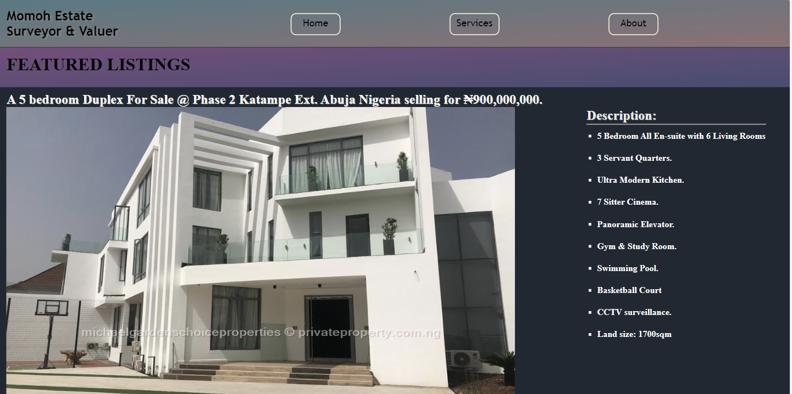
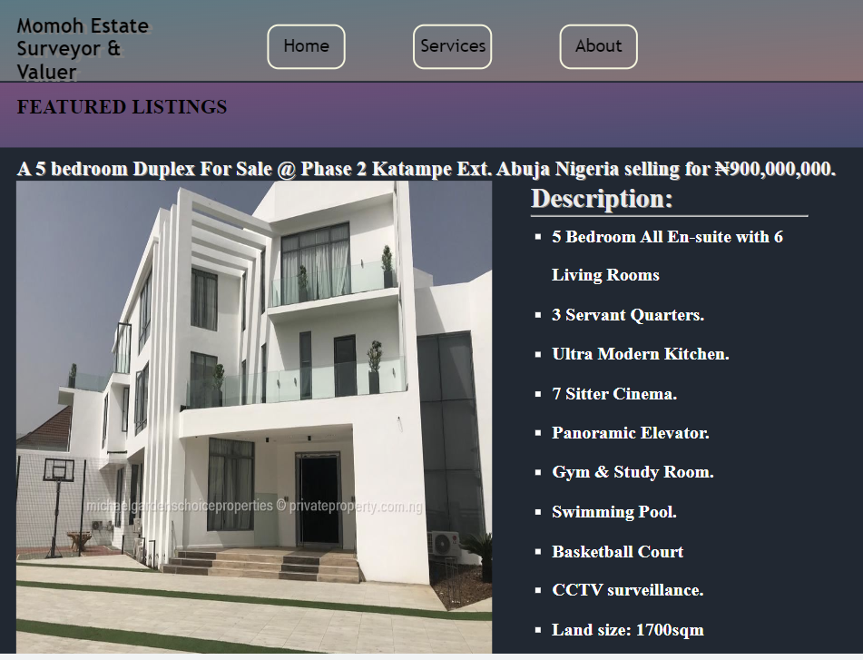
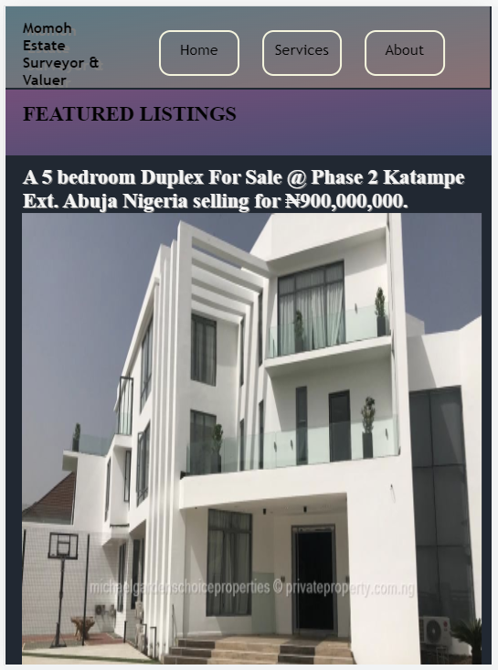
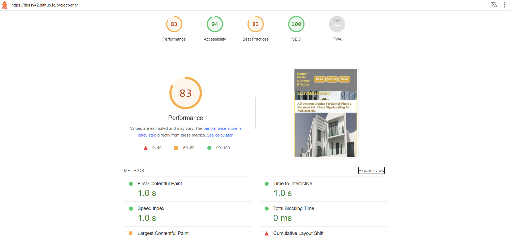

# project-one
This Realtor website [Realtor](https://dussy42.github.io/project-one/) is mainly html and css based showing what my real estate firm (Momoh estate surveyor and valuer ) has to offer potential clients majorly in real estate needs and investment appraisal. Potential client visiting this website will benefit from wealth of experience and reputation we have in the real estate industry in property valuation, property management and agency.

FEATURES
1 Navigation
Here we have the name of the realtor company at the left-top corner(Momoh estate surveyor and valuer ). 

To the right is in the navigation is Home, About and Services link

The navigation is well structured to make it easier for potential clients to navigate with good color combination and font.

2 CONTENTS

1 The first here is the 
FEATURED PROPERTIES as the header on the top left corner, below that is huge image of a property at katampe and to the right is brief description of this property(features,location, value) and below it is segmented picture of the other views of the property. 

2 Similar lay-out of the above is common to this other luxury property at katampe abuja with a main image to the left and to the right is the detailed information(address, features, value) about this property followed below by sidev-view and interior of the property stacked side by side. 

3 About Us
 Here tells intending users about what we are briefly with a background image as the header and within the background-image is About Us heading with a touch of animation styling. Below this is the name(Momoh estate surveyor and valuer )  at the left corner in a bold font and further below is where the user gets information about who we are and what we represent. It well style with nice background color.

 4 Services
  The services section is just below the About Us , starting with a background image in which we have Services to the left and brief details on the right ,all on the background image with a nice font and color for readability. In addition, below the background image is Manage Properties & Portfolios header with details to the left and valuation Header with information to the right. They are both styled similarly with same background color.
  
  5 Footer
  Ultimately here we have the company's contact information to the left hand corner and in the middle is subscribe to our newsletter while at the right is an input tag with a submit beside it.

  Credits
  All codes were organically made by me apart from images which i got from [Grenadines Homes](https://grenadineshomes.com/) [Property in Nigeria](https://www.privateproperty.com.ng/ )  [Capital Luxury Realty](https://capitalluxury.com/)

2 VALIDATOR TESTING
 W3C was used to validate my html while jigsaw was used for css and both turn out to be no error.Be that as it may, i affrirm  upon using lighthouse in devtools that the website is accessibile with legible fonts and well lighted colors

 

